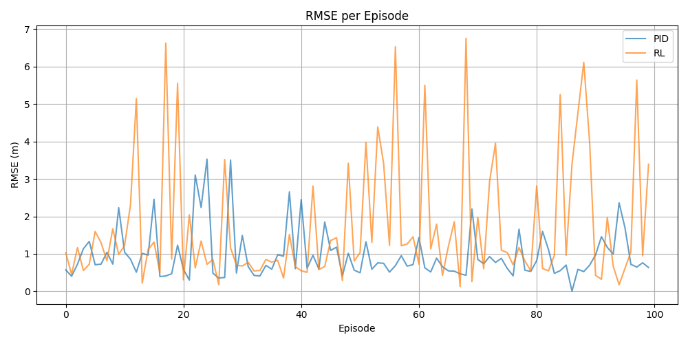
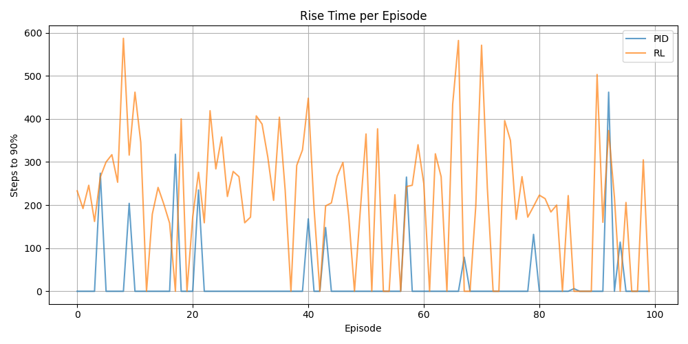
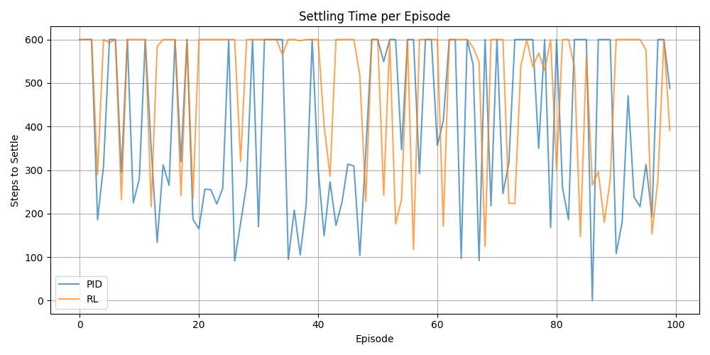

# RL vs PID Quadcopter Controller Comparison

This project compares the performance of a PID controller and a Reinforcement Learning (RL) controller for a quadcopter waypoint tracking task. The comparison is based on running both controllers on the same set of randomly generated start and end positions for 100 episodes, and analyzing metrics such as RMSE, rise time, and settling time.

## Project Structure

- `runsim_pid.py` — Runs the PID controller for 100 episodes, saving actual and desired positions for each episode.
- `runsim_scaledObs.py` — Runs the RL controller for 100 episodes, using the same start/end pairs as PID, and saves actual and desired positions.
- `Comparizon.py` — Loads the saved data, computes metrics (RMSE, rise time, settling time), and generates comparison plots (saved in `saved_plots/` and shown interactively).
- `generate_random_pairs.py` — Generates the `random_start_end_pairs.npy` file with 100 random start/end pairs for reproducible experiments.
- `random_start_end_pairs.npy` — Data file containing the random start/end pairs used by both controllers.
- `saved_plots/` — Folder where comparison plots are saved.

## Usage

1. **Generate Random Start/End Pairs**
   ```
   python generate_random_pairs.py
   ```
   This creates `random_start_end_pairs.npy`.

2. **Run PID Controller**
   ```
   python runsim_pid.py
   ```
   This saves `pid_actual_positions_episodes.npy` and `pid_desired_positions_episodes.npy`.

3. **Run RL Controller**
   ```
   python runsim_scaledObs.py
   ```
   This saves `rl_actual_positions_episodes.npy` and `rl_desired_positions_episodes.npy`.

4. **Analyze and Visualize Results**
   ```
   python Comparizon.py
   ```
   This computes metrics, saves plots to `saved_plots/`, and displays them interactively.

## Requirements
- Python 3.8+
- numpy
- matplotlib
- stable-baselines3 (for RL controller)

Install dependencies with:
```
pip install numpy matplotlib stable-baselines3
```

## Comparison Metrics

| Metric        | PID (Mean ± Std) | RL (Mean ± Std) |
|---------------|------------------|-----------------|
| RMSE (m)      | 0.962956         | 1.715404        |
| Rise Time     | 24.05            | 211.82          |
| Settling Time | 399.84           | 500.87          |

## Comparison Plots


**RMSE per Episode**



**Rise Time per Episode**



**Settling Time per Episode**



## Notes
- Both controllers use the same random start/end pairs for fair comparison.
- All data and plots are saved in the current directory or `saved_plots/`.
- You can adjust the number of episodes or other parameters in the scripts as needed.

## Authors
- Rajitha Niroshan

---
For any issues or questions, please contact the repository owner.
